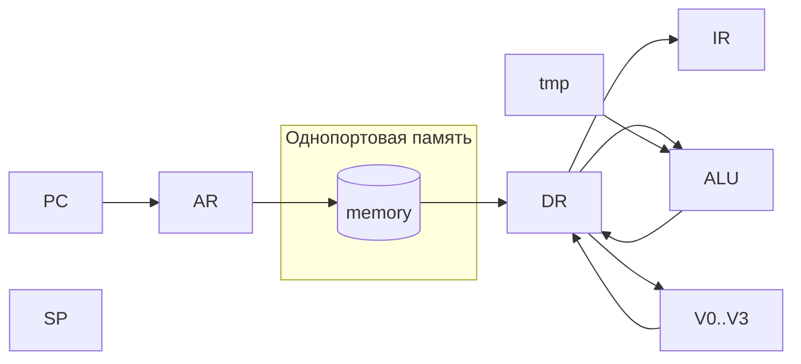
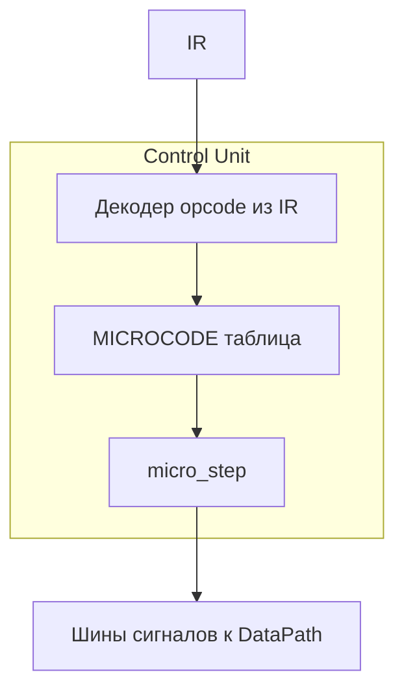

# Лабораторная работа №4 — модель процессора и транслятор

[](https://github.com/kr1v0mr0/lab4csa/actions/workflows/ci.yml)

## Шапка (заполнить перед сдачей)

| Поле | Значение |
|------|----------|
| **ФИО** | Крылова Мария Дмитриевна |
| **Группа** | P3209 |
| **Вариант** | `asm \| stack \| neum \| mc \| tick \| binary \| stream \| port \| cstr \| prob1 \| vector` |

---

## 1. Язык программирования (ассемблер)

### 1.1. Синтаксис (фрагмент в стиле БНФ)

```bnf
<program>     ::= { <line> }
<line>        ::= <label>? <stmt>? ( ";" <comment> )? | <directive>
<label>       ::= <ident> ":"   ; метка в начале строки или «метка: команда» в одной строке
<stmt>        ::= <opcode> { <operand> } | <opcode>
<operand>     ::= "#" <number> | <ident> | <reg> | <number>
<directive>   ::= ".section" <ident>
                 | ".org" <number>
                 | ".equ" <ident> <number>
                 | ".asciz" "\"" { <char> } "\""
                 | ".macro" <ident>
                 | ".endm"
                 | ".if" <if-expr>
                 | ".else"
                 | ".endif"
<if-expr>     ::= <number> | "#" <number> | <ident>   ; для <ident> — значение из .equ
<reg>         ::= "V0" | "V1" | "V2" | "V3"
<number>      ::= <decimal> | "0x" <hex>
<ident>       ::= буквы, цифры, "_", не начиная с цифры
```

Комментарий в конце строки: от `;` до конца строки.

### 1.2. Семантика (кратко)

- **Стратегия вычислений**: стековая; операнды большинства операций берутся с вершины стека, результат кладётся обратно (см. микрокод конкретных инструкций).
- **Области видимости**: одна глобальная область; метки и `.equ` — глобальные имена.
- **Типизация**: динамическая по сути модели — значения в памяти и на стеке — целые Python `int` (в отчёте можно трактовать как знаковые 32-бит с расширением при необходимости).
- **Литералы**: непосредственный `#число` (в т.ч. `0x...`); строка `.asciz` даёт последовательность машинных слов по одному символу на слово + нулевое слово.
- **Процедуры**: инструкции `CALL <метка>` сохраняют адрес возврата (текущий `PC` после вызова) в стеке и передают управление по адресу; `RET` извлекает адрес возврата со стека в `PC`.
- **Execution token (косвенный вызов)**: на стек кладётся адрес входа подпрограммы (часто через `PUSH <метка>` / `PUSH #addr`), затем выполняется `IEXEC`: снимается токен, в стек кладётся адрес возврата, переход по токену (аналог исполнения «по указателю»).

### 1.3. Макросы и условная компиляция

| Возможность | Реализация |
|-------------|------------|
| **Константы** | `.equ ИМЯ число` — подстановка в операндах (в т.ч. в условиях `.if`, заданных ранее в том же проходе препроцессора). |
| **Секции** | `.section имя` — маркер структуры; на размещение кода не влияет. |
| **Макросы** | Блок `.macro ИМЯ` … `.endm`. Тело — строки ассемблера; подстановка аргументов вызова в `\1` … `\9` (вызов: строка `ИМЯ арг1 арг2 …` без метки в начале). Имя макроса не должно совпадать с мнемоникой из `opcodes.py`. |
| **Условная компиляция** | Вложенные `.if <выражение>`, `.else`, `.endif`. Выражение: целое, `#число` или идентификатор из `.equ`. Строки в ложной ветви в выход препроцессора не попадают (кроме директив, управляющих вложенным `.if`). |

**Ограничение:** определение `.macro` извлекается из файла до условной компиляции, поэтому макрос, записанный внутри ложной ветви `.if`, всё равно регистрируется (учебное упрощение; в отчёте зафиксировано). Вызов макроса в одной строке с меткой не поддержан.

### 1.4. CI (GitHub Actions)

Репозиторий: [github.com/kr1v0mr0/lab4csa](https://github.com/kr1v0mr0/lab4csa). Статус сборки — бейдж в шапке README.

Workflow: [`.github/workflows/ci.yml`](https://github.com/kr1v0mr0/lab4csa/blob/main/.github/workflows/ci.yml) (`ruff`, `mypy`, `pytest`).

---

## 2. Прерывания

В **данной реализации** нет аппаратной модели прерываний: нет вектора сброса, IRQ, сохранения контекста в стеке ядром.

**Концептуально (для отчёта):** в фон Неймановской машине вектор прерываний мог бы располагаться по фиксированным адресам; обработчик сохранял бы `PC`, флаги, переключал бы `PC` на адрес из таблицы векторов. Связка с микропрограммой: отдельная микропрограмма «вход в прерывание» (микро-последовательность сохранения и диспетчеризации).

---

## 3. Организация памяти

- **Одна** адресуемая память `memory[0..N-1]` (модель фон Неймана): и инструкции, и данные.
- **PC** — счётчик команд; **SP** — указатель стека (растёт в сторону уменьшения адреса при `push`).
- **Векторные регистры** `V0..V3`: по 4 элемента в каждом (внутреннее состояние процессора, не адресуемые как обычная память).
- **Литералы в коде**: машинное слово инструкции с непосредственным полем (младшие 20 бит аргумента) — см. ограничение ниже.
- **Строки `.asciz`**: подряд идущие 32-битные слова в том же адресном пространстве, что и код.

**Ограничение (важно для отчёта):** непосредственный операнд в слове команды — **20 бит** (`arg & 0xFFFFF`). Для демонстрации 64-битной арифметики в `int64.asm` используется схема «младшее слово + перенос в старшее», а не литерал `0xFFFFFFFF` в одном поле.

---

## 4. Система команд

- **Стековая CISC-подобная** модель: много работы за одну макрокоманду за счёт микропрограммы.
- **Порты**: `IN порт`, `OUT порт` — номер порта в младших 20 битах инструкции; поток ввода по умолчанию на порту `0`, основной вывод golden-тестов — порт `1`.
- **Тактовая точность**: один вызов `takt()` соответствует одному такту; внутри такта выполняется один «шаг» микропрограммы (список сигналов).

Полный перечень см. `src/opcodes.py`; циклы по микрокодам — в `src/microcode.py`.

---

## 5. Транслятор

Консоль: `python translator.py <исходник.asm> <выход.bin> [листинг.lst]`.

Порядок обработки:

1. **Препроцессор** (см. `translator.py`): извлечение определений `.macro` / `.endm`; условная компиляция `.if` / `.else` / `.endif`; раскрытие вызовов макросов; повторный проход `.if` для веток, появившихся из развёрнутых макросов.
2. **Первый проход** (`step1`): метки (включая `метка: команда`), `.equ`, `.section`, `.org`, `.asciz` — расчёт адресов и очередь строк.
3. **Второй проход** (`step2`): генерация 32-битных слов big-endian, выравнивание `.org` словами `NOP`, листинг `адрес - HEX - мнемоника`.

Для сценария **prob1** в golden-тестах используется укороченная программа `src/examples/prob1_smoke.asm` (малые границы циклов); полный перебор — `src/examples/prob1.asm`.

---

## 6. Модель процессора

Запуск: `python machine.py <bin> [input.txt] [--trace] [--quiet] [--trace-prefix N [файл]]]`.

- **`--quiet`**: только текст вывода на порт `1` (для golden и пайпов).
- **`--trace`**: печать строки состояния на каждом такте (интерактивный режим без `--quiet`).
- **`--quiet --trace-prefix N`**: полный прогон до `HALT`, на **stderr** — первые `N` строк `repr(Processor)` (префикс журнала); на stdout — вывод порта `1`. Третий аргумент после `N` — путь: записать префикс трассы в файл вместо stderr.

### 6.1. DataPath (упрощённая схема)



### 6.2. Control Unit и микрокод



Микропрограмма хранится в Python-структуре (`microcode.py`) как **отдельное** от массива `memory` описание — упрощение относительно требования «ПЗУ микропрограмм», допустимое в учебной модели; в отчёте зафиксировано явно.

---

## 7. Сравнение векторной и скалярной реализации

Две небольшие программы в `src/examples/`:

| Программа | Смысл | Полных тактов до остановки |
|-----------|--------|----------------------------|
| `bench_scalar.asm` | Четыре раза сложить пары на стеке | **124** |
| `bench_vector.asm` | Заполнить `V1`, `V2` константами, одно `V_ADD V3,V1,V2` | **34** |

Измерение: `from machine import run_until_halt` после трансляции (или счётчик тактов в симуляторе). Векторная операция выполняет **четыре** сложения за одну макрокоманду на уровне ISA, поэтому меньше тактов на полезную работу при одинаковой размерности.

---

## 8. Golden-тесты, CI, ruff, mypy

### 8.1. Структура golden

В каталоге `tests/golden/<имя>/` для каждого сценария хранятся:

| Файл | Содержимое |
|------|------------|
| `expect.stdout` | вывод на порт `1` после полного прогона |
| `expect.lst` | листинг транслятора (`адрес - HEX - мнемоника`) |
| `expect.trace.txt` | префикс журнала (первые *N* строк состояния до такта; *N* задан в `tests/test_golden.py`) |

Перегенерация эталонов после осознанного изменения ISA или симулятора:

```text
python scripts/regen_golden.py
```

### 8.2. Сценарии

| Каталог | Исходник | Примечание |
|---------|----------|------------|
| `hello_world` | `src/examples/hello_world.asm` | hello |
| `hello_user_name` | `src/examples/hello_user_name.asm` | ввод из фикстуры |
| `sort` | `src/examples/sort.asm` | |
| `int64` | `src/examples/int64.asm` | 64-битная арифметика по словам |
| `cat` | `src/examples/cat.asm` | |
| `vector` | `src/examples/vector.asm` | |
| `macro_smoke` | `src/examples/macro_smoke.asm` | `.macro` + `.if` |
| `prob1_smoke` | `src/examples/prob1_smoke.asm` | алгоритм prob1, малые границы |

### 8.3. Инструменты

| Компонент | Где |
|-----------|-----|
| **pytest** | `tests/test_golden.py` — сравнение листинга, stdout и префикса трассы с эталонами |
| **CI** | `.github/workflows/ci.yml` — `ruff check`, `mypy`, `pytest` |
| **ruff / mypy** | `pyproject.toml` (добавлены правила `B` к ruff; mypy — на исходниках `src/`) |

---

## 9. Пример цепочки

```text
cd src
python translator.py examples/hello_world.asm /tmp/hw.bin /tmp/hw.lst
python machine.py /tmp/hw.bin --quiet
```

С вводом:

```text
python translator.py examples/hello_user_name.asm /tmp/hu.bin
python machine.py /tmp/hu.bin ../tests/fixtures/hello_user_input.txt --quiet
```

---

## 10. Структура репозитория

```text
src/                 — translator.py, machine.py, microcode.py, opcodes.py
src/examples/        — исходники демонстраций и бенчм
tests/               — pytest
tests/golden/        — эталоны stdout, листинга, префикса трассы
tests/fixtures/      — ввод для тестов
scripts/             — regen_golden.py (перегенерация эталонов)
.github/workflows/   — CI
```

---

## 11. Ограничения и честные упрощения

- Нет промышленных сообщений об ошибках, парсер минимальный.
- Макросы без формальных параметров-имён (только `\1`…`\9`); вызов с меткой в одной строке не поддержан; определение макроса в ложной ветви `.if` всё равно попадает в таблицу макросов (см. §1.3).
- Нет линковщика и отдельных сегментов загрузки.
- Нет модели прерываний в коде.
- Поле непосредственного операнда **20 бит** — для больших констант нужна загрузка из памяти или несколько инструкций.

---

## 12. Самооценка по критериям (шкала 0–40)

**Ориентир: 34–36 баллов** при уверенном объяснении на защите микрокода, потока данных и проходов транслятора; репозиторий и бейдж CI: см. шапку README и §1.4.

| Критерий | Комментарий |
|----------|-------------|
| Соответствие варианту | Стек, фон Нейман, микрокод по тактам, бинарный вывод, потоковый ввод/порты, строки, векторные операции, процедуры, `IEXEC`, **`.macro` / `.if`**, сравнение vector/scalar в отчёте. |
| Golden-тесты | Не «только stdout»: эталонный **листинг**, **префикс журнала**, **вывод**; сценарий prob1 — через `prob1_smoke.asm` (полный `prob1.asm` остаётся в репозитории для демонстрации). |
| Типичные снижения из методички | Микрокод в виде таблицы Python (аргументировано в §6.2); нет аппаратных прерываний; mypy/ruff не на максимальной «паранойе» — частично компенсируется явными ограничениями в отчёте. |
| До 40 | Потребовались бы, например, отдельное ПЗУ микрокодов в модели памяти, более строгий статический анализ без ослаблений и полный prob1 в CI с укороченным журналом при сохранении нагрузки. |
