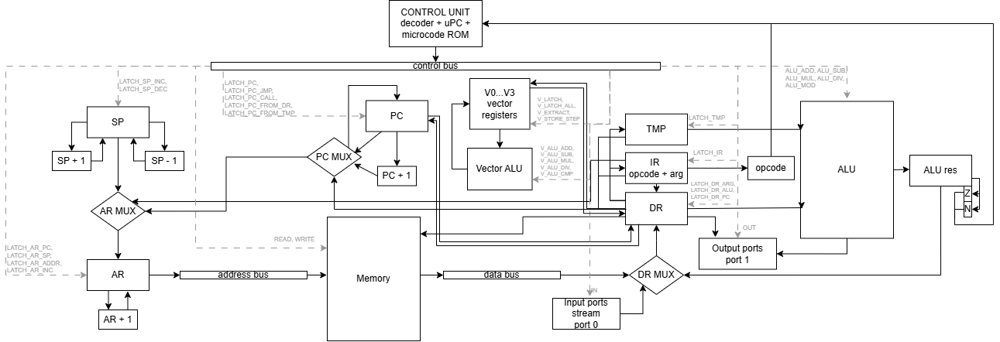
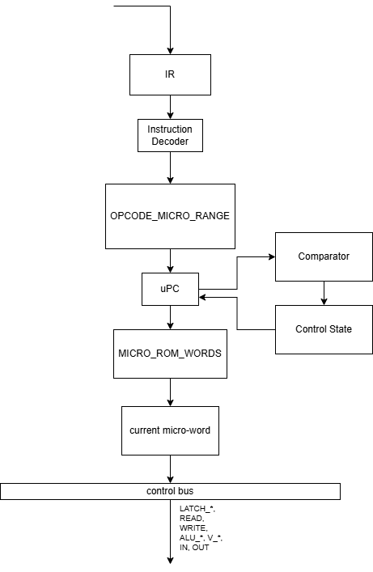

# Лабораторная работа №4 - модель процессора и транслятор

[](https://github.com/kr1v0mr0/lab4csa/actions/workflows/ci.yml)


| **ФИО** | Крылова Мария Дмитриевна |
| **Группа** | P3209 |
| **Вариант** | `asm \| stack \| neum \| mc \| tick \| binary \| stream \| port \| cstr \| prob1 \| vector` |

---

## 1. Язык программирования

В проекте реализован минимальный ассемблер. Он не является промышленным языком: диагностика ошибок и парсер намеренно простые, но синтаксиса достаточно для написания процедур, работы со строками, макросами, условной компиляцией и демонстрационными алгоритмами.

### 1.1. Синтаксис

```bnf
<program>      ::= { <line> }
<line>         ::= <label>? <statement>? ( ";" <comment> )?
                 | <directive>

<label>        ::= <ident> ":"
<statement>    ::= <opcode> { <operand> }
<operand>      ::= "#" <number>
                 | <ident>
                 | <vreg>
                 | <number>

<directive>    ::= ".section" <ident>
                 | ".org" <number>
                 | ".equ" <ident> <number>
                 | ".asciz" "\"" { <char> } "\""
                 | ".macro" <ident>
                 | ".endm"
                 | ".if" <if-expr>
                 | ".else"
                 | ".endif"

<if-expr>      ::= <number> | "#" <number> | <ident>
<vreg>         ::= "V0" | "V1" | "V2" | "V3"
<number>       ::= <decimal> | "0x" <hex>
<ident>        ::= буквы, цифры, "_", не начиная с цифры
<comment>      ::= любой текст до конца строки
```

Комментарий начинается с `;`. Метка может стоять отдельно или в форме `label: COMMAND ...`.

### 1.2. Семантика

- **Стратегия вычислений** - стековая. Большинство скалярных операций берет операнды с вершины стека и кладет результат обратно.
- **Область видимости** - одна глобальная область имен. Метки и `.equ` видны во всем файле после проходов транслятора.
- **Типизация** - значения трактуются как целые числа. В симуляторе они представлены Python `int`, в машинном коде инструкция занимает 32-битное слово.
- **Числовые литералы** - непосредственные значения записываются как `#10`, `#0x0A` или через `.equ`. Непосредственное поле инструкции ограничено 20 битами.
- **Строковые литералы** - `.asciz "text"` размещает в общей памяти по одному символу на машинное слово и завершается нулевым словом.
- **Процедуры** - `CALL label` кладет адрес возврата на стек и загружает `PC` адресом процедуры. `RET` снимает адрес возврата со стека.
- **Execution token** - адрес процедуры можно положить на стек (`PUSH label`) и выполнить через `IEXEC`. Это аналог косвенного вызова по адресу.
- **Условная компиляция** - `.if`, `.else`, `.endif` выполняются на этапе препроцессора.
- **Макросы** - `.macro NAME` ... `.endm`, аргументы подставляются как `\1` ... `\9`.

### 1.3. Директивы

| Директива | Назначение |
|-----------|------------|
| `.section NAME` | Логический маркер секции. На отдельные сегменты памяти не раскладывает, так как архитектура фон Неймана использует единую память. |
| `.org N` | Установить текущий адрес трансляции. Пропущенные слова заполняются `NOP`. |
| `.equ NAME VALUE` | Объявить числовую константу. |
| `.asciz "..."` | Разместить C-строку: символы по одному слову и завершающий `0`. |
| `.macro NAME` / `.endm` | Описать пользовательский макрос. |
| `.if` / `.else` / `.endif` | Условная компиляция по целому выражению. |

Ограничение макросов: формальных имен параметров нет, используются только позиционные `\1` ... `\9`. Вызов макроса в строке с меткой не поддержан.

---

## 2. Организация памяти

Архитектура - фон Неймана: команды и данные лежат в одном массиве памяти.

```text
Unified memory: memory[0..2047], word = 32 bits
+--------------------------------------------------------------+
| низкие адреса                                                |
| 0      : первая инструкция программы                         |
| ...    : машинный код, процедуры, статические данные          |
| .asciz : символы строки, один символ на слово, затем NUL      |
| .org   : пропущенные адреса заполняются NOP                   |
| ...                                                          |
| 2047   : начальная вершина стека                              |
| высокие адреса, стек растет вниз                              |
+--------------------------------------------------------------+
```

Доступные программисту элементы:

| Элемент | Назначение |
|---------|------------|
| `memory[]` | Единая память команд и данных, 2048 слов. |
| Стек | Основное место хранения временных значений и аргументов операций. |
| `PC` | Счетчик команд. Напрямую программистом не адресуется, но меняется переходами, `CALL`, `RET`, `IEXEC`. |
| `SP` | Указатель стека. Стек растет в сторону уменьшения адресов. |
| Порты | Номера портов задаются в аргументе `IN`/`OUT`. |
| `V0..V3` | Четыре векторных регистра по четыре элемента. |

Внутренние регистры процессора:

| Регистр | Назначение |
|---------|------------|
| `AR` | Адресный регистр для обращения к `memory[]`. |
| `DR` | Регистр данных для чтения/записи памяти и портов. |
| `IR` | Регистр текущей инструкции. |
| `TMP` | Временный регистр для второго операнда ALU. |
| `ALU_RES` | Защелка результата ALU. |
| `Z`, `N` | Флаги нуля и отрицательного результата. |
| `_micro_pc` | Счетчик микрокоманд, адрес в ПЗУ микропрограмм. |

### 2.1. Размещение объектов

| Объект | Трансляция | Исполнение |
|--------|------------|------------|
| Инструкции | Каждая инструкция кодируется одним 32-битным словом. | `FETCH` читает слово по `PC` в `IR`, затем запускается микропрограмма opcode. |
| Числовые литералы | `#imm` попадает в младшие 20 бит инструкции. | `LATCH_DR_ARG` переносит аргумент в `DR`, затем значение кладется на стек или используется как адрес/порт. |
| Константы `.equ` | Подставляются транслятором в операнды. | В памяти отдельного объекта не создают. |
| Строки `.asciz` | Записываются подряд: `ord(char)` по одному слову и завершающий `0`. | Процедуры печати читают символы до нуля. |
| Переменные | Явно задаются адресами памяти и используются через `PUSH_ADDR`/`POP`. | Хранятся в единой памяти. |
| Стековые значения | Не размещаются транслятором заранее. | `PUSH`, `CALL`, `IN`, арифметика и процедуры двигают `SP`. |
| Процедуры | Это обычные метки внутри единой памяти. | `CALL` сохраняет адрес возврата на стеке, `RET` восстанавливает `PC`. |
| Векторные данные | Могут быть загружены из памяти через `V_LOAD` или заполнены через `V_FILL`. | `V0..V3` обновляются векторными микросигналами. |

---

## 3. Система команд

Классификация ISA:

- **Stack** - основные вычисления ведутся через стек, а не через набор общих регистров.
- **CISC-подобная** - одна макрокоманда может раскрываться в несколько микротактов.
- **Microcoded** - выполнение макрокоманд задается микропрограммами из отдельного ПЗУ.
- **Port-mapped I/O** - ввод/вывод выполняется специальными инструкциями `IN` и `OUT`.
- **Vector extension** - есть векторные регистры и операции над четырьмя lanes.

### 3.1. Кодирование инструкции

Машинное слово - 32 бита, файл записывается в big-endian:

```text
31          24 23      20 19                              0
+-------------+----------+--------------------------------+
| opcode      | v_bits   | arg / immediate / address      |
+-------------+----------+--------------------------------+
```

| Поле | Размер | Назначение |
|------|--------|------------|
| `opcode` | 8 бит | Код операции. |
| `v_bits` | 4 бита | Номер векторного регистра-результата для векторных инструкций. |
| `arg` | 20 бит | Непосредственное значение, адрес, порт или дополнительные векторные регистры. |

Для `V_ADD`, `V_SUB`, `V_MUL`, `V_DIV`, `V_CMP` регистры-операнды упакованы так:

```text
arg[19:18] - первый векторный операнд
arg[17:16] - второй векторный операнд
```

Общий fetch занимает **1 такт**:

| Такт | Сигналы | Действие |
|------|---------|----------|
| 1 | `LATCH_AR_PC`, `READ` | `AR <- PC`, `DR <- memory[AR]`. |
| 2 | `LATCH_IR`, `LATCH_PC` | `IR <- DR`, `PC <- PC + 1`. |

### 3.2. Таблица инструкций

`Fetch+execute` - полный цикл исполнения макрокоманды, включая общий двухтактный fetch.

| Мнемоника | Opcode | Операнды | Execute, тактов | Fetch+execute | Семантика |
|-----------|--------|----------|-----------------|---------------|-----------|
| `NOP` | `0x00` | - | 1 | 3 | Нет операции. |
| `PUSH_ADDR` | `0x01` | `addr` | 2 | 4 | Прочитать `memory[addr]` и положить значение на стек. |
| `PUSH` | `0x02` | `#imm` / `label` | 2 | 4 | Положить 20-битный аргумент на стек. |
| `POP` | `0x03` | `addr` | 2 | 4 | Снять значение со стека и записать в `memory[addr]`. |
| `DUP` | `0x04` | - | 2 | 4 | Продублировать верхнее значение стека. |
| `DROP` | `0x05` | - | 1 | 3 | Удалить верхнее значение стека. |
| `ADD` | `0x06` | - | 3 | 5 | Сложить два верхних значения стека. |
| `SUB` | `0x07` | - | 3 | 5 | Вычесть верхнее значение из следующего. |
| `MUL` | `0x08` | - | 3 | 5 | Умножить два верхних значения. |
| `DIV` | `0x09` | - | 3 | 5 | Целочисленное деление; деление на ноль дает `0`. |
| `MOD` | `0x0A` | - | 3 | 5 | Остаток от деления; деление на ноль дает `0`. |
| `CMP` | `0x0B` | - | 3 | 5 | Сравнить два значения через вычитание, обновить `Z/N`, убрать операнды. |
| `JMP` | `0x10` | `addr` | 1 | 3 | Безусловный переход. |
| `JZ` | `0x11` | `addr` | 1 | 3 | Переход, если `Z = 1`. |
| `JNZ` | `0x12` | `addr` | 1 | 3 | Переход, если `Z = 0`. |
| `HALT` | `0x13` | - | 1 | 3 | Остановить модель. |
| `IN` | `0x14` | `port` | 2 | 4 | Прочитать токен из входного потока порта и положить на стек. |
| `OUT` | `0x15` | `port` | 2 | 4 | Снять значение со стека и записать в выходной поток порта. |
| `JN` | `0x16` | `addr` | 1 | 3 | Переход, если `N = 1`. |
| `CALL` | `0x17` | `addr` | 3 | 5 | Сохранить адрес возврата на стеке и перейти к процедуре. |
| `RET` | `0x18` | - | 2 | 4 | Снять адрес возврата со стека в `PC`. |
| `IEXEC` | `0x19` | - | 5 | 7 | Снять execution token, сохранить адрес возврата и перейти по токену. |
| `V_LOAD` | `0x20` | `Vx, addr` | 5 | 7 | Загрузить 4 слова из памяти в векторный регистр. |
| `V_STORE` | `0x21` | `Vx, addr` | 5 | 7 | Сохранить 4 элемента векторного регистра в память. |
| `V_ADD` | `0x22` | `Vd, Va, Vb` | 1 | 3 | Поэлементное сложение векторов. |
| `V_MUL` | `0x23` | `Vd, Va, Vb` | 1 | 3 | Поэлементное умножение векторов. |
| `V_FILL` | `0x24` | `Vx` | 2 | 4 | Заполнить векторный регистр значением с вершины стека. |
| `V_EXTRACT` | `0x25` | `Vx, lane` | 2 | 4 | Извлечь lane из вектора и положить на стек. |
| `V_SUB` | `0x26` | `Vd, Va, Vb` | 1 | 3 | Поэлементное вычитание векторов. |
| `V_DIV` | `0x27` | `Vd, Va, Vb` | 1 | 3 | Поэлементное целочисленное деление; деление на ноль дает `0`. |
| `V_CMP` | `0x28` | `Va, Vb` | 1 | 3 | `Z = 1`, если все lanes равны; `N` определяется по первому отличию. |

---

## 4. Транслятор

Консольный интерфейс:

```text
python translator.py <source.asm> <output.bin> [output.lst]
```

Вход:

- исходный файл на ассемблере;
- имя файла для бинарного машинного кода;
- необязательное имя listing-файла.

Выход:

- настоящий бинарный файл с 32-битными словами big-endian;
- listing-файл формата `address - HEXCODE - mnemonic`.

Этапы трансляции:

1. **Извлечение макросов** - блоки `.macro` ... `.endm` сохраняются в таблицу макросов.
2. **Условная компиляция** - `.if`, `.else`, `.endif` фильтруют строки.
3. **Раскрытие макросов** - позиционные параметры `\1` ... `\9` подставляются в тело.
4. **Повторная условная компиляция** - нужна для условий, появившихся после раскрытия макросов.
5. **Первый проход** - вычисление адресов меток, `.org`, `.asciz`, `.equ`.
6. **Второй проход** - кодирование инструкций, генерация бинарника и listing.

Пример строки listing:

```text
4 - 22360000 - V_ADD V3 V1 V2
```

---

## 5. Модель процессора

Консольный интерфейс:

```text
python machine.py <program.bin> [input.txt] [--trace] [--quiet] [--trace-prefix N [file]]
```

Режимы:

| Режим | Назначение |
|-------|------------|
| Без ключей | Печатает служебные сообщения, итоговое число тактов и вывод. |
| `--quiet` | Печатает только вывод порта `1`, удобно для golden-тестов. |
| `--trace` | Печатает состояние процессора перед каждым тактом. |
| `--trace-prefix N` | Сохраняет первые `N` строк журнала, чтобы golden-файлы не разрастались. |

Строка журнала содержит:

- `TICK`;
- `PC`, `SP`, `AR`, `DR`, `IR`;
- флаги `Z`, `N`;
- фазу `FETCH` или `EXECUTE`;
- адрес микрослова `uPC`;
- сигналы CU на следующий такт;
- декодированную мнемонику текущей или следующей инструкции;
- последнее событие ввода-вывода.

Пример:

```text
TICK:    2 | PC:   1 | SP: 2047 | AR:    0 | DR:  385875970 | IR: 17000002 | Z: 0 | N: 0 | STEP: EXECUTE | uPC:  39 | SIG: LATCH_DR_PC | INS: CALL 2 | IO: -
```

### 5.1. DataPath


### 6.2. Control Unit и микрокод

Control Unit является микропрограммным. Он не исполняет макрокоманду напрямую: сначала выбирается инструкция в `IR`, затем по `opcode` выбирается диапазон микрокода, и каждый такт из отдельного ПЗУ микропрограмм выдается одно микрослово с сигналами для DataPath.



Микрокод хранится отдельно от основной памяти:

- `FETCH_PROGRAM` - общий двухтактный `FETCH`;
- `MICROPROGRAMS` - последовательность микропрограмм для opcode, не словарь микрокода;
- `_build_micro_rom()` собирает линейное ПЗУ `MICRO_ROM_WORDS`;
- `OPCODE_MICRO_RANGE` хранит `(start, length)` для каждой макрокоманды;
- один вызов `takt()` исполняет одно микрослово, то есть один набор сигналов CU.

Алгоритм работы CU:

1. Любая команда начинается с общего `FETCH`.
2. Такт `FETCH 1`: `LATCH_AR_PC`, `READ`, то есть `PC -> AR -> memory[] -> DR`.
3. Такт `FETCH 2`: `LATCH_IR`, `LATCH_PC`, то есть `DR -> IR`, `PC <- PC + 1`.
4. Decoder берет `opcode` из `IR`.
5. По `OPCODE_MICRO_RANGE[opcode]` выбирается старт и длина микропрограммы.
6. `uPC` последовательно читает микрослова из `MICRO_ROM_WORDS`.
7. Каждое микрослово выдает набор сигналов в DataPath.
8. После последнего микрослова команда завершена, следующий такт снова начинает `FETCH`.

Подробный потактовый разбор всех команд ISA вынесен в [COMMAND_TICKS.md](COMMAND_TICKS.md).

Пример для `ADD`:

```text
FETCH, 2 такта:
  t1: LATCH_AR_PC, READ
      PC -> AR -> memory[] -> DR

  t2: LATCH_IR, LATCH_PC
      DR -> IR
      PC <- PC + 1

EXECUTE, 3 такта:
  t3: LATCH_AR_SP, READ
      SP -> AR -> memory[] stack area -> DR

  t4: LATCH_TMP, LATCH_SP_INC, LATCH_AR_SP, READ
      DR -> TMP
      SP <- SP + 1
      SP -> AR -> memory[] stack area -> DR

  t5: ALU_ADD, LATCH_DR_ALU, WRITE
      DR + TMP -> ALU -> ALU_RES -> DR
      DR -> memory[] stack area
```

### 5.3. Сигналы CU

| Группа | Сигналы |
|--------|---------|
| Память | `READ`, `WRITE` |
| Защелки регистров | `LATCH_IR`, `LATCH_TMP`, `LATCH_DR_ARG`, `LATCH_DR_ALU`, `LATCH_DR_PC` |
| Адресный тракт | `LATCH_AR_PC`, `LATCH_AR_SP`, `LATCH_AR_ADDR`, `LATCH_AR_INC` |
| PC | `LATCH_PC`, `LATCH_PC_JMP`, `LATCH_PC_CALL`, `LATCH_PC_FROM_DR`, `LATCH_PC_FROM_TMP` |
| Стек | `LATCH_SP_DEC`, `LATCH_SP_INC` |
| ALU | `ALU_ADD`, `ALU_SUB`, `ALU_MUL`, `ALU_DIV`, `ALU_MOD` |
| I/O | `IN`, `OUT` |
| Векторы | `V_LATCH`, `V_LATCH_ALL`, `V_EXTRACT`, `V_STORE_STEP`, `V_ALU_ADD`, `V_ALU_SUB`, `V_ALU_MUL`, `V_ALU_DIV`, `V_ALU_CMP` |
| Управление | `HALT` |

---

## 6. Ввод-вывод

Ввод-вывод реализован как поток токенов через порты.

| Инструкция | Поведение |
|------------|-----------|
| `IN port` | Читает один символ из очереди входного порта. Если вход закончился, модель останавливается. |
| `OUT port` | Добавляет значение в буфер выходного порта. |

По соглашению golden-тестов:

- входной поток подается на порт `0`;
- основной текстовый вывод читается с порта `1`;
- символ хранится как код `ord(char)`.

---

## 7. Векторное расширение

Процессор содержит четыре векторных регистра `V0..V3`, каждый по четыре элемента.

Минимальный набор из варианта реализован:

| Операция | Инструкция |
|----------|------------|
| Сложение | `V_ADD` |
| Вычитание | `V_SUB` |
| Умножение | `V_MUL` |
| Деление | `V_DIV` |
| Сравнение | `V_CMP` |

Дополнительные операции:

- `V_FILL` - заполнить вектор одним скалярным значением;
- `V_LOAD` - загрузить 4 слова из памяти;
- `V_STORE` - сохранить 4 слова в память;
- `V_EXTRACT` - достать один lane на стек.

Сценарий `src/examples/vector_ops.asm` демонстрирует весь минимальный набор `V_ADD`, `V_SUB`, `V_MUL`, `V_DIV`, `V_CMP`.

### 7.1. Сравнение производительности

| Программа | Смысл | Полных тактов до остановки |
|-----------|-------|----------------------------|
| `bench_scalar.asm` | Четыре скалярных сложения через стек | **67** |
| `bench_vector.asm` | Заполнить `V1`, `V2` и выполнить одно `V_ADD V3,V1,V2` | **22** |

Векторная версия выполняет четыре сложения одной ISA-командой `V_ADD`, поэтому дает меньший бюджет тактов на ту же полезную работу.

---

## 8. Тестирование

Golden-тесты проверяют всю цепочку:

```text
исходник asm -> транслятор -> бинарный код/listing -> симулятор -> stdout/trace
```

Структура каждого каталога `tests/golden/<case>/`:

| Файл | Содержимое |
|------|------------|
| `expect.lst` | Эталон listing-файла: адрес, HEX-код, мнемоника. |
| `expect.stdout` | Эталон вывода процессора. |
| `expect.trace.txt` | Представительный префикс тактовой трассы. |

Сценарии:

| Каталог | Исходник | Что проверяет |
|---------|----------|---------------|
| `hello_world` | `src/examples/hello_world.asm` | Печать строки, процедуры, C-string. |
| `cat` | `src/examples/cat.asm` | Потоковый ввод до EOF и вывод. |
| `hello_user_name` | `src/examples/hello_user_name.asm` | Ввод имени, хранение C-string, приветствие. |
| `sort` | `src/examples/sort.asm` | Сортировка списка, процедуры, сравнения и переходы. |
| `int64` | `src/examples/int64.asm` | Арифметика двойной точности через пары 32-битных слов. |
| `prob1_smoke` | `src/examples/prob1_smoke.asm` | Укороченный алгоритм варианта `prob1`. |
| `vector` | `src/examples/vector.asm` | Базовая векторная операция. |
| `vector_ops` | `src/examples/vector_ops.asm` | Все обязательные векторные ALU-команды. |
| `macro_smoke` | `src/examples/macro_smoke.asm` | Макросы и условная компиляция. |
| Полный `prob1` | `src/examples/prob1.asm` | Полный алгоритм варианта, stdout и бюджет тактов. |

Полный `prob1` вынесен в `tests/test_prob1_full.py`, чтобы не хранить огромную трассу. Тест проверяет вывод и ожидаемый бюджет примерно **5.2M** тактов.

Команды проверки:

```text
pytest -q
python -m ruff check .
python -m mypy src tests
```

---

## 9. Пример использования

Из каталога `src`:

```text
python translator.py examples/hello_world.asm hw.bin hw.lst
python machine.py hw.bin --quiet
```

С входным файлом:

```text
python translator.py examples/hello_user_name.asm hu.bin hu.lst
python machine.py hu.bin ../tests/fixtures/hello_user_input.txt --quiet
```

С трассой:

```text
python machine.py hu.bin ../tests/fixtures/hello_user_input.txt --trace
```

Перегенерация golden-файлов:

```text
python scripts/regen_golden.py
```

---

## 10. CI и качество кода

В `.github/workflows/ci.yml` настроены:

- `ruff check src tests scripts`;
- `mypy`;
- `pytest tests -v`.

Настройки находятся в `pyproject.toml`:

- `ruff`: правила `E`, `F`, `I`, `W`, `B`;
- `mypy`: `strict = true`, проверяются `src/machine.py`, `src/translator.py`, `src/microcode.py`, `src/opcodes.py`.

---

## 11. Структура репозитория

```text
.github/workflows/     CI
scripts/               regen_golden.py
src/                   translator.py, machine.py, microcode.py, opcodes.py
src/examples/          программы для демонстраций и тестов
tests/                 pytest
tests/fixtures/        входные данные и эталоны полного prob1
tests/golden/          listing, stdout и trace-prefix для golden-тестов
pyproject.toml         настройки ruff/mypy/pytest
README.md              отчет
```
